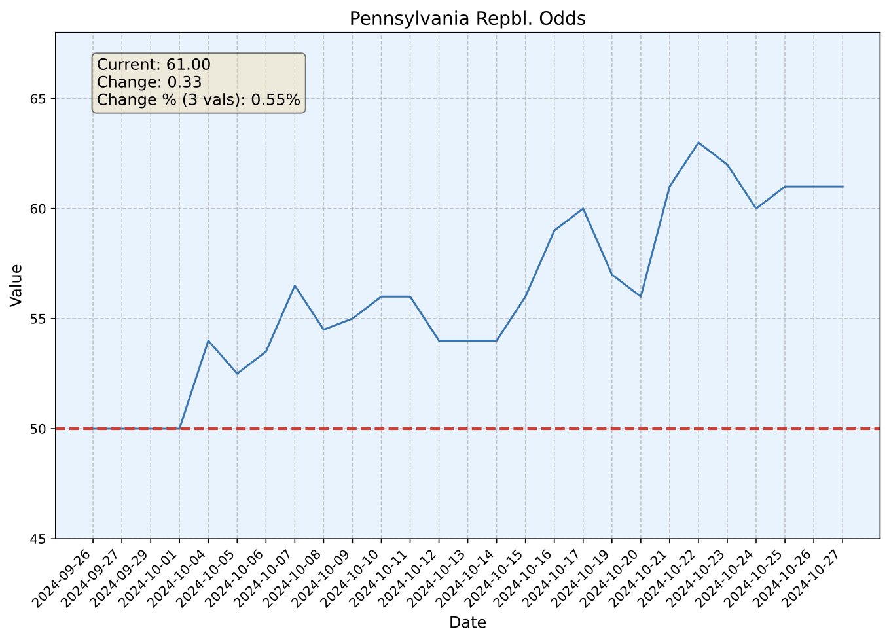
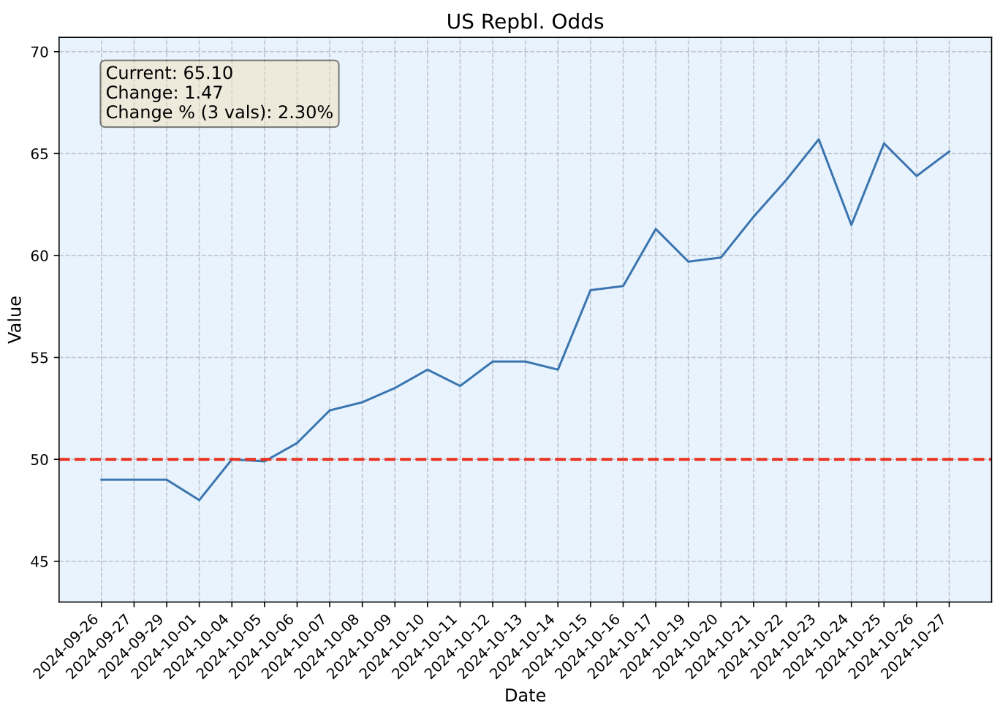

# Scraping Polymarket | Prediction Market Tool | U.S. Presidential Election 2024 | Electoral & State

### Developed By:

Anders Kiss 

---

## What are Prediction Markets?
Prediction markets are trading platforms where people can bet real money on the outcome of future events - in this case, the 2024 US Presidential Election. This application scrapes the website, [Polymarket](https://polymarket.com/), for market odds. These markets often provide more accurate forecasts than traditional polls because participants have a financial stake in being correct. When many people trade based on their best information, the market price becomes a probability estimate of an event occurring.

## Project Overview
This tool automatically collects and analyzes data from election prediction markets for the 2024 US Presidential Election. It tracks:
- Betting odds for both major political parties
- Total money being wagered
- Market activity in key swing states
- Related financial market indicators

## Example Data Visualization
Below are examples of the prediction market odds tracking for both Pennsylvania and overall US Republican chances in the 2024 election:



*Pennsylvania Republican betting odds over time, showing current value of 61.00 with a 0.55% change*



*US Republican betting odds over time, showing current value of 65.10 with a 2.30% change*

These visualizations demonstrate the daily tracking of betting odds, with the red dashed line representing the 50% threshold. Values above this line indicate the market favors a Republican win in that race.

## Technical Details

### Features
- Automated data collection from multiple prediction market sources
- Efficient data storage using Parquet format (a high-performance file format)
- Data analysis and visualization tools
- Automated quality checks:
  - Duplicate entry prevention
  - Data validation
  - Error logging

### Data Collected Daily
1. National-level metrics:
   - Republican and Democratic odds
   - Total betting volume (in USD)
   
2. State-level data for each swing state:
   - Party-specific odds
   - Betting volume
   - Percentage of total national market
   
3. Financial market indicators:
   - S&P 500 (SPX) - Major US stock market index
   - Russell 2000 (IWM) - Small-cap US stocks index
   - Bitcoin (BTCUSDT) - Leading cryptocurrency price

## Setup Instructions

### 1. Installation
First, clone this repository:
```bash
git clone https://github.com/yourusername/prediction-market-election-2024.git
cd prediction-market-election-2024
```

### 2. Environment Setup
We use Conda for managing dependencies. If you don't have Conda, download it from [Anaconda's website](https://www.anaconda.com/products/distribution).

Create and activate the environment:
```bash
conda create --name prediction_market python=3.9
conda activate prediction_market
pip install -r requirements.txt
```

### 3. Running the Project
The main script handles all data collection:
```bash
python main.py
```

### Additional Tools
Several utility scripts are available:
- `script_ALL_DATA_SCRAPE_DEMO.py`: Full data collection demonstration
- `script_demo_scrape_US_data.py`: US-specific data collection
- `script_demo_scrape_polymarket.py`: Polymarket-specific scraper
- `script_remove_last_record_parquet.py`: Data correction tool
- `convert_parquet_to_csv.py`: Convert data to spreadsheet format

## Data Management
Data is stored in Parquet format, which provides:
- Efficient storage (smaller file sizes)
- Fast read/write operations
- Strong data type preservation

To convert data to CSV for spreadsheet analysis:
1. Run: `python convert_parquet_to_csv.py`
2. Select your target Parquet file
3. Find the CSV output in the same folder

## Dependencies
Core packages:
- pandas: Data manipulation
- pyarrow: Parquet file handling
- seaborn/matplotlib: Data visualization
- requests/beautifulsoup4: Web scraping

For reproducibility:
```bash
# Export environment
conda env export > environment.yml

# Create environment from file
conda env create -f environment.yml
```
